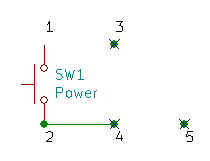
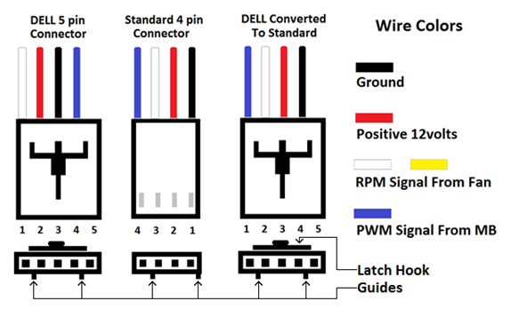

# Dell Optiplex 790 - 3rd gen Intel

A compilation of useful information for Optiplex 790 conversions or maitenance.

## Power/Reset header pinout

Pins 1 and 2 are shorted together whenever the power button is pressed.

2 and 4 are always connected, albeit with a high resistance.

3 and 5 are always unconnected and I could not determine a purpose for them without a dedicated reset button (which the Optiplex 790 stock chassis does not have).

Note that these DO NOT follow the standard for modern non-Dell motherboards, and they will not fit in most of them. Even if they did fit, you should pay attention to the pinning, that is unlike any modern standard chassis header. 

Another thing to note is that it DOES NOT reach the motherboard headers if those are placed at the bottom, perpendicular with the I/O shield. An extension is required.

## Buzzer

The buzzer does not attend to modern standards either. You should seek for information in your motherboard manual for its operation. There should be a single red wire and three black wires connected together, which act as the signal and ground terminals, respectively. For use in a modern motherboard, you should snip those off and connect them appropriately.

## PSU

The PSU comes with 4-pin ATX, Motherboard and 3 SATA connections, and may include a stray pair of black wires in some cases (such as the 250W model). Those can be safely ignored if not using a Dell motherboard.

# Front USB

Image by Linus Tech Tips forum user Extra8.

Front USB comes in this form, and will not fit properly on a parallel port header, as it should. Connect wiring according to image and your motherboard specifications in modern motherboards.

# Fan

Image by Speedstep on Dell support forums/Dell

Front stock fan does not adhere to standards for regular fans. DO NOT plug it in without rewiring it as it might fry the fan or the controller in some cases.

# Form Factor

This case fits up to Micro-ATX easily, no problems at all. Avoid using ATX motherboards using this chassis, as it will require extensive modifications that will ruin parts of the chassis and will not provide a pleasant experience.

